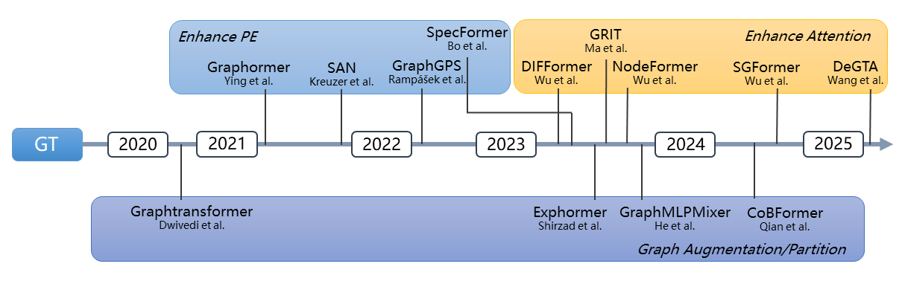

# OpenGT

[](https://opengt.readthedocs.io/en/latest/?badge=latest)

Official code for [OpenGT](https://openreview.net/forum?id=qa1nx4CYID), a comprehensive and extensible benchmark suite built on top of [`torch_geometric.graphgym`](https://github.com/pyg-team/pytorch_geometric/tree/master/graphgym), designed for evaluating and analyzing **Graph Transformers (GTs)** under a unified framework.

## Overview

The picture below shows a timeline of GT development, dividing GTs into 3 categories.



## 🔧 Features

- ✅ **Standardized Implementations** of 16 Graph Transformer and GNN baselines, including:
  - GT models: `Graphormer`, `NodeFormer`, `DIFFormer`, `GraphGPS`, `GRIT`, `SpecFormer`, `Exphormer`, `SAN`, `SGFormer`, `CoBFormer`, `GraphMLPMixer`, `GraphTransformer`, `DeGTA`
  - GNN baselines: `GCN`, `GAT`, `APPNP`
- 📊 **Unified Training and Evaluation Pipeline**
  - Consistent data splits and batch sizes per dataset
  - Standardized metric computation and logging
- 🧪 **Flexible Hyperparameter Tuning**
  - Provides an easy-to-use interface for performing grid search over multiple hyperparameters
  - Supports specifying search spaces via configuration files
  - Automatically logs and evaluates results across all combinations for robust comparison
- 📁 **Diverse Datasets**
  - Covers both **node-level** and **graph-level** tasks
  - Includes graphs with varying levels of **homophily** and **sparsity**

## 🎯 Goal

**OpenGT** aims to promote:
- 📌 Fair and reproducible comparisons across Graph Transformers
- 🔍 Deeper understanding of design choices and their practical implications
- 🚀 Acceleration of GT research through a solid benchmarking foundation

## ⚙ Python environment setup with Conda

```bash
conda create -n opengt python=3.10
conda activate opengt

pip install torch==2.5 torchvision torchaudio --index-url https://download.pytorch.org/whl/cu124

pip install torch_geometric

pip install pyg_lib torch_scatter torch_sparse torch_cluster torch_spline_conv -f https://data.pyg.org/whl/torch-2.5.0+cu124.html

# RDKit is required for OGB-LSC PCQM4Mv2 and datasets derived from it.  
conda install openbabel fsspec rdkit

pip install pytorch-lightning yacs torchmetrics
pip install performer-pytorch
pip install tensorboardX
pip install ogb
pip install wandb
pip install pymetis
pip install opt-einsum

conda clean --all
```

## 🚀 Running Experiments

### 1. Activate Environment

First, activate the project environment:

```bash
conda activate opengt
```

---

### 2. Run a Single Experiment

Use `main.py` along with a configuration file to launch an experiment. Configuration files are stored in:

```
configs/<ModelName>/<DatasetName-ModelName>.yaml
```

#### Example: Run DIFFormer on Cora (3 runs)

```bash
python main.py --cfg configs/DIFFormer/cora-DIFFormer.yaml --repeat 3
```

Results will be saved automatically to:

```
results/DIFFormer/cora-DIFFormer/
```

---

### 3. Hyperparameter Tuning

To perform grid search on hyperparameters, use the provided `run_batch.sh` script and corresponding grid files under the `grids/` directory.


```bash
bash run_batch.sh
```

Please note that the grid file and the configuration file names should be modified in the script.

Each line of the grid file should be written in the following format:

```text
<Config parameter name> <Display name> <List of possible values>
```

For example:

```text
gt.layers nlayer [1,2,3,4]
gt.aggregate agg ['add', 'cat']
gt.dropout dropout [0.2, 0.5, 0.8]
```

This will explore all parameter combinations defined in the relevant grid configuration.

---

### 4. Aggregating Results

To summarize and aggregate results from multiple runs:

```bash
python agg_test.py
```

This script collects results across seeds and outputs averaged performance metrics with standard deviations in to a `.csv` file.

## 📚 References

| Paper Title | Authors | Venue | Year | Link |
|-------------|---------|-------|------|------|
| Semi-Supervised Classification with Graph Convolutional Networks | Thomas Kipf, Max Welling | ICLR | 2017 | [GCN](https://arxiv.org/abs/1609.02907) |
| Graph Attention Networks | Petar Veličković et al. | ICLR | 2018 | [GAT](https://arxiv.org/abs/1710.10903) |
| Predict Then Propagate: Graph Neural Networks Meet Personalized PageRank | Johannes Gasteiger et al. | ICLR | 2019 | [APPNP](https://arxiv.org/abs/1810.05997) |
| A Generalization of Transformer Networks to Graphs | Vijay Prakash Dwivedi, Xavier Bresson | AAAI | 2021 | [Graphtransformer](https://arxiv.org/abs/2012.09699) |
| Do Transformers Really Perform Badly for Graph Representation? | Chengxuan Ying et al. | NeurIPS | 2021 | [Graphormer](https://proceedings.neurips.cc/paper/2021/hash/f1c1592588411002af340cbaedd6fc33-Abstract.html) |
| Rethinking Graph Transformers with Spectral Attention | Devin Kreuzer et al. | NeurIPS | 2021 | [SAN](https://proceedings.neurips.cc/paper_files/paper/2021/hash/b4fd1d2cb085390fbbadae65e07876a7-Abstract.html) |
| Nodeformer: A Scalable Graph Structure Learning Transformer for Node Classification | Qitian Wu et al. | NeurIPS | 2022 | [NodeFormer](https://proceedings.neurips.cc/paper_files/paper/2022/hash/af790b7ae573771689438bbcfc5933fe-Abstract-Conference.html) |
| Recipe for a General, Powerful, Scalable Graph Transformer | Ladislav Rampášek et al. | NeurIPS | 2022 | [GraphGPS](https://arxiv.org/abs/2205.12454) |
| Graph Inductive Biases in Transformers Without Message Passing | Liheng Ma et al. | ICML | 2023 | [GRIT](https://proceedings.mlr.press/v202/ma23c.html) |
| DIFFormer: Scalable (Graph) Transformers Induced by Energy Constrained Diffusion | Qitian Wu et al. | ICLR | 2023 | [DIFFormer](https://arxiv.org/abs/2301.09474) |
| SGFormer: Simplifying and Empowering Transformers for Large-Graph Representations | Qitian Wu et al. | NeurIPS | 2023 | [SGFormer](https://proceedings.neurips.cc/paper_files/paper/2023/hash/cc57fac10eacadb3b72a907ac48f9a98-Abstract-Conference.html) |
| Specformer: Spectral Graph Neural Networks Meet Transformers | Deyu Bo et al. | ICLR | 2023 | [SpecFormer](https://arxiv.org/abs/2303.01028) |
| Exphormer: Sparse Transformers for Graphs | Hamed Shirzad et al. | ICML | 2023 | [Exphormer](https://proceedings.mlr.press/v202/shirzad23a.html) |
| A Generalization of ViT/MLP-Mixer to Graphs | Xiaoxin He et al. | ICML | 2023 | [GraphMLPMixer](https://proceedings.mlr.press/v202/he23a.html) |
| Less is More: On the Over-Globalizing Problem in Graph Transformers | Yujie Xing et al. | ICML | 2024 | [CoBFormer](https://proceedings.mlr.press/v235/xing24b.html) |
| Graph Triple Attention Network: A Decoupled Perspective | Xiaotang Wang et al. | KDD | 2025 | [DeGTA](https://arxiv.org/abs/2408.07654) |


