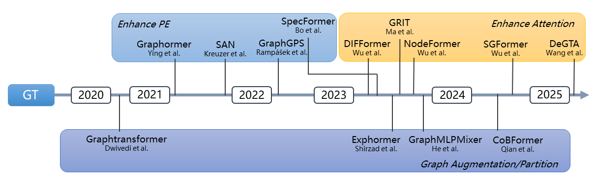

:github_url: https://github.com/opengt/opengt

OpenGT Documentation
===================================

**OpenGT** is a benchmark for Graph Transformers.

It is designed for evaluating and analyzing Graph Transformers (GTs) under a unified framework.

.. note::

   This project is under active development.

Citation
--------

If you use our benchmark in your works, we would appreciate citations to the paper:

.. code-block:: bibtex

   currently under review

.. toctree::
   :glob:
   :maxdepth: 3
   :caption: Getting Started

   notes/installation
   notes/example
   notes/tutorial

.. toctree::
   :glob:
   :maxdepth: 3
   :caption: Modules

   opengt.config
   opengt.loader
   opengt.encoder
   opengt.layer
   opengt.head
   opengt.network

Indices and tables
==================

* :ref:`genindex`
* :ref:`modindex`
* :ref:`search`